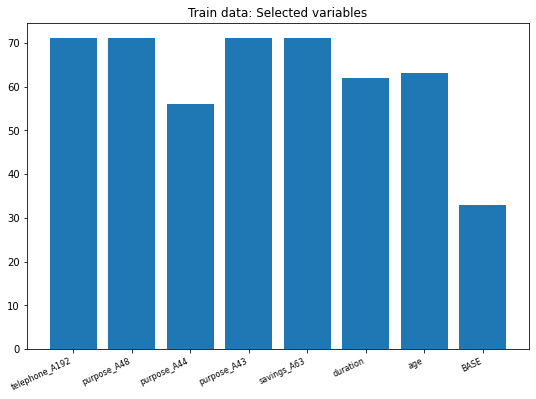
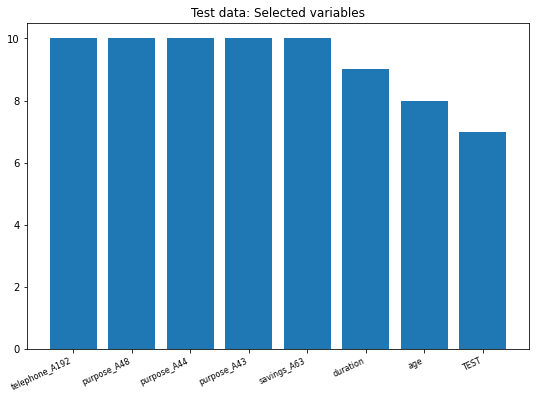

## @TOPTAL's Pandas exercise solution

This is a possible solution to the Pandas exercise of @TOPTAL.

It is important to remember that it is asked only to import three Python's libraries, but I also import Random to select 5 columns randomly, and make the output even more interesting, than selecting arbitrary columns, it is not requested to do a _correlation_ graph of table, but we did it to take two important variables to complement the analysis.

The expected time is only 30 minutes.

```python
import numpy as np
import pandas as pd
from sklearn.tree import DecisionTreeClassifier
from sklearn.model_selection import train_test_split
from sklearn.metrics import confusion_matrix
from random import randint
from matplotlib import pyplot as plt
```


```python
data_test = pd.read_csv('test.csv')
data_train = pd.read_csv('train.csv')
```

This is a sample of the Credit risk database, the full data contains 48 columns.

| duration | credit\_amount | installment\_rate | present\_residence | age  | existing\_credits | target |
| -------- | -------------- | ----------------- | ------------------ | ---- | ----------------- | ------ |
| 0        | 36             | 8086              | 2                  | 4    | 42                | 1      |
| 2        | 36             | 2145              | 2                  | 1    | 24                | 1      |
| 4        | 21             | 5003              | 1                  | 4    | 29                | 1      |
| 1        | 15             | 3812              | 1                  | 4    | 23                | 0      |
| 5        | 15             | 2327              | 2                  | 3    | 25                | 1      |
| 3        | 12             | 2578              | 3                  | 4    | 55                | 0      |

###  THE TRAIN DATABASE

In that way, we wrote a function to split the train data, considering a size of 30% of the database for the test sample.


```python
def uplo(db):
    y = db['target']
    X = db.drop('target', axis=1)
    xt, xte, yt, yte = train_test_split(X, y, test_size=0.3, random_state=42)
    print('The shape of X dataset', X.shape[0])
    print('The shape of X_train', xt.shape[0])
    
    return xt,xte,yt,yte
```


```python
X_train, X_test, y_train, y_test = uplo(data_train)
```

    The shape of X dataset 900
    The shape of X_train 630

As we see the size of the train data is small of only 630 rows (observations).

### CORRELATION MATRIX


```python
corrMatrix = data_train.corr()
print(corrMatrix['target'][:10].sort_values(ascending=False))
```

    duration                       0.223492
    credit_amount                  0.168680
    checking_account_status_A12    0.116657
    installment_rate               0.065554
    present_residence              0.007676
    dependents                    -0.002630
    existing_credits              -0.055938
    checking_account_status_A13   -0.082670
    age                           -0.097674
    checking_account_status_A14   -0.315427

As an example, we show only the first 10 variables with a decreasing order from the target, as shown below we take 'duration' and 'age' as our main explanatory variables, this is just an example, an it is not required. 

### THE TREE MODEL

```python
fp = []
nu = [randint(2, 49) for p in range(2, 7)]
nam = list(X_train.columns[nu])
nam.extend(['duration','age'])
nam
```

To begin we take randomly 5 variables from the database and added  'duration' and 'age', so the total number of explanatory variables are 7.


    ['telephone_A192',
     'purpose_A48',
     'purpose_A44',
     'purpose_A43',
     'savings_A63',
     'duration',
     'age']

To continue we construct our function with five arguments:

* The first is an empty list, defined above that will contains the False positive values from the confusion matrix.
* The second and third are the Train and Test database of X (explanatory variables).
* The fourth and fifth are the Train and Test database of the target variable.

To succeed in the exercise, it is required to make the permutation using Numpy's permutation for each column and save it as a different temporal data frame at least for the modeling part, after that we perform the Decision tree classifier for each of the seven permutated columns.  Then we make the prediction of our target variable.

As a metric, it is required to construct the Feature Importance of each classification exercise, we did that considering the 'False Positive coefficient' (FP) defined as a Type I error (overestimation error); at the last part of the function, we run the _Decision tree_ on the non-shuffle database (original) and add its FP coefficient to the list.


```python
def stree(fl,xt,xte,yt,yte):
    for i in xt.loc[:,nam]:
        df = xt.iloc[np.random.permutation(xt[i].values)]
        clf = DecisionTreeClassifier()
        clf = clf.fit(df,yt)
 #Predict the response for test dataset
        y_pred = clf.predict(xte)
        cm = confusion_matrix(yte, y_pred)
        print(cm[1,0])
        fl.append(cm[1,0])
   
    clf = clf.fit(xt,yt)
    y_base = clf.predict(xte)
    cm = confusion_matrix(yte, y_base)
    fl.append(cm[1,0])
    return fl
```


```python
stree(fp,X_train,X_test,y_train,y_test)
```

    71
    71
    56
    71
    71
    62
    63


    [71, 71, 56, 71, 71, 62, 63, 33]


```python
re = nam.copy()
re.append('BASE')
```

Calling DataFrame constructor after zipping


```python
lt = pd.DataFrame(list(zip(re, fp)),columns =['Name', 'CM val'])
lt
```


<div>
<style scoped>
    .dataframe tbody tr th:only-of-type {
        vertical-align: middle;
    }

    

<table border="1" class="dataframe">
  <thead>
    <tr style="text-align: center;">
      <th></th>
      <th>Name</th>
      <th>CM val</th>
    </tr>
  </thead>
  <tbody>
    <tr>
      <th>0</th>
      <td>telephone_A192</td>
      <td>71</td>
    </tr>
    <tr>
      <th>1</th>
      <td>purpose_A48</td>
      <td>71</td>
    </tr>
    <tr>
      <th>2</th>
      <td>purpose_A44</td>
      <td>56</td>
    </tr>
    <tr>
      <th>3</th>
      <td>purpose_A43</td>
      <td>71</td>
    </tr>
    <tr>
      <th>4</th>
      <td>savings_A63</td>
      <td>71</td>
    </tr>
    <tr>
      <th>5</th>
      <td>duration</td>
      <td>62</td>
    </tr>
    <tr>
      <th>6</th>
      <td>age</td>
      <td>63</td>
    </tr>
    <tr>
      <th>7</th>
      <td>BASE</td>
      <td>33</td>
    </tr>
  </tbody>
</table>


```python
fig, ax = plt.subplots(figsize = (9, 6))
ax.bar(re, fp)
plt.setp(plt.gca().get_xticklabels(), rotation=25, horizontalalignment='right', fontsize=8)
plt.title('Train data: Selected variables')
plt.show()
```


​    

​    


 MODEL ON DATA TEST


```python
X_train, X_test, y_train, y_test = uplo(data_test)
```

    The shape of X dataset 100
    The shape of X_train 70


```python
fpt = []
```


```python
stree(fpt,X_train,X_test,y_train,y_test)
```

    10
    10
    10
    10
    10
    9
    8


    [10, 10, 10, 10, 10, 9, 8, 7]


```python
ret = nam.copy()
ret.append('TEST')
```

Calling DataFrame constructor after zipping<br>
xg = lt['CM val']


```python
fig, ax = plt.subplots(figsize = (9, 6))
plt.bar(ret, fpt)
plt.setp(plt.gca().get_xticklabels(), rotation=25, horizontalalignment='right', fontsize=8)
plt.title('Test data: Selected variables')
plt.show()
```



​    

